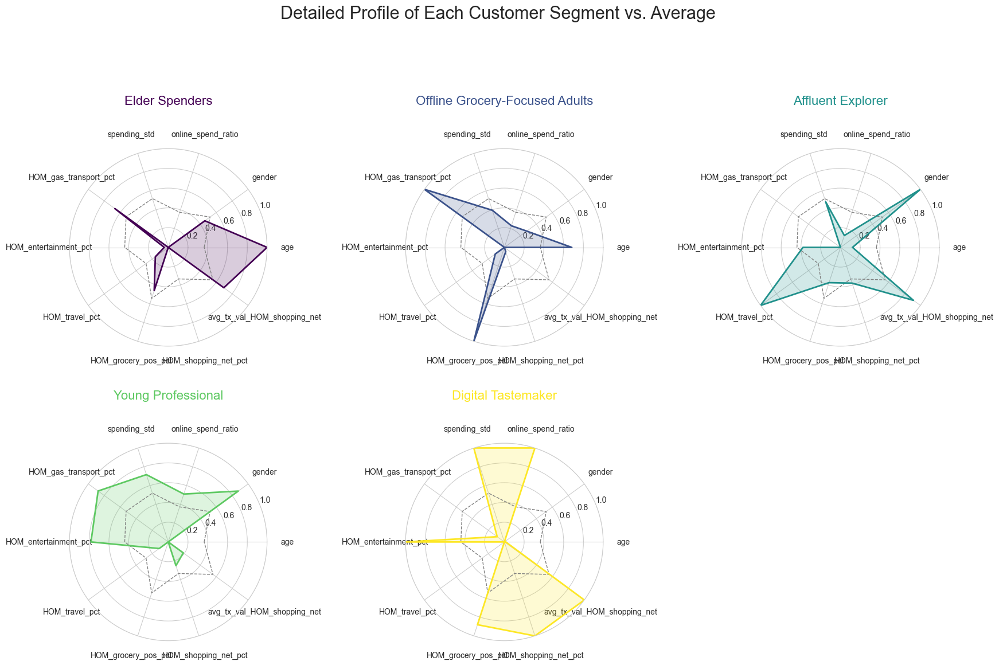

# Customer Segmentation

This project transforms transaction behavior into five actionable customer personas. It combines exploratory analysis, customer-level feature engineering, Gaussian mixture modeling, and business interpretation to support more relevant marketing campaigns.

[View the analysis notebook](main_eda.ipynb) | [View the presentation](Customer%20Segmentation%20Presentation.pdf)



## Business problem

One-size-fits-all marketing can waste budget and overlook meaningful differences between customers. This analysis aims to:

1. Understand customer spending patterns.
2. Group customers with similar behavior.
3. Build clear profiles for the resulting segments.
4. Recommend personalized marketing strategies for each group.

## Dataset

The dataset contains 42,676 half-of-month transaction summaries, 37 columns, and 908 unique customers across 2019 and 2020. It includes customer demographics, total spending, category-level spending, transaction frequency, and online or point-of-sale activity.

Initial checks found no missing values or duplicate rows. Twenty-five customers with unusually high average half-of-month spending were removed using an interquartile-range rule so the segmentation would focus on the broader customer population.

## Approach

The analysis includes:

- Exploratory analysis of spending distributions, seasonality, demographics, categories, and purchase frequency.
- Customer-level aggregation of spending behavior across time.
- Feature engineering for category spending shares, average transaction values, spending variability, age, gender, and online-to-offline preference.
- Removal of strongly correlated features and standardization of model inputs.
- Gaussian mixture model comparison using Bayesian information criterion, silhouette score, and assignment entropy.
- Two-dimensional visual checks with PCA, t-SNE, and multidimensional scaling.
- Cluster profiling and translation into business-friendly personas.

Gaussian mixture modeling was selected because it can represent elliptical clusters and provides a probability of membership for each customer rather than only a hard assignment.

## Customer segments

The selected model identifies five segments:

| Cluster | Persona | Profile | Suggested strategy |
| ---: | --- | --- | --- |
| 0 | Elder Spenders | Older customers with balanced spending across essentials and conservative online use | Offer senior perks, relevant discounts, and offline engagement |
| 1 | Offline Grocery-Focused Adults | Mature customers who favor in-store grocery and fuel spending | Use loyalty-based grocery promotions, cashbacks, and fuel partnerships |
| 2 | Affluent Explorers | Affluent male customers with premium, travel-oriented, and digitally engaged behavior | Promote premium services, travel benefits, and targeted digital offers |
| 3 | Young Professionals | Younger customers with broad interests across offline and online categories | Offer multi-category rewards and lifestyle-focused subscriptions |
| 4 | Digital Tastemakers | Younger female customers with frequent, lower-value, online-heavy transactions | Promote wallet upgrades, online rebates, rewards, and flash deals |

The largest segment is the Offline Grocery-Focused Adults group, while Affluent Explorers form the smallest segment.

## Key findings

- Most half-of-month spending values fall below 5,000, with a small number of high-spending outliers.
- Spending shows seasonal peaks, particularly around December and January.
- Grocery point-of-sale, shopping point-of-sale, and gas or transport are leading spending categories.
- Customers who purchase more frequently also tend to spend more.
- The five segments differ in age, gender mix, channel preference, category allocation, and spending variability.

## Project structure

```text
customer-segmentation/
├── data/
│   └── Data.csv
├── figs/
│   └── 1.png ... 21.png
├── Customer Segmentation Presentation.pdf
├── main_eda.ipynb
└── README.md
```

## Run the notebook

From this project directory:

```bash
python -m venv .venv
source .venv/bin/activate
python -m pip install jupyter pandas numpy matplotlib seaborn scipy scikit-learn
jupyter notebook main_eda.ipynb
```

Before running all cells, update the notebook's data-loading cell to use the repository-relative path:

```python
df = pd.read_csv("data/Data.csv")
```

The committed notebook currently contains a machine-specific absolute path.

## Limitations

- Segment names are business interpretations, not inherent labels in the source data.
- Removing high-spending outliers makes the profiles more representative of typical customers but excludes a potentially valuable niche.
- Cluster quality metrics support the five-segment solution, but business value still needs campaign testing.
- Customer behavior and segment membership may change over time, so the model should be monitored and refreshed.
- The analysis describes behavioral differences and should not be interpreted as causal evidence.
